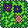
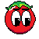
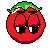
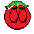
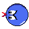
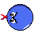
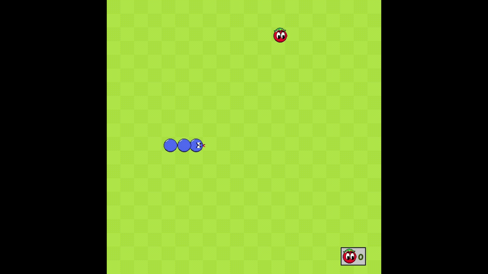
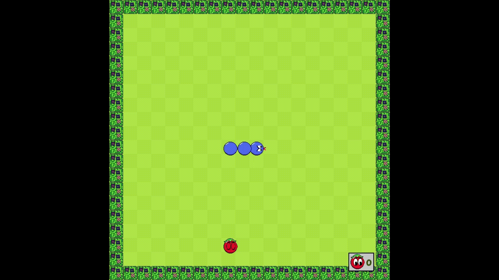

# Welcome to Snake 🐍 game !
## ✅ Todo:
- [ ] Add Sounds to the game.
- [ ] Add a gameover screen displaying the final score.
- [ ] Add a two-player mode with two snakes.
- [ ] Some code refactoring.
- [ ] Train an RL agent to play the game.

## 🎨 Game Sprites
All sprites are drawn by me 😊 using the following website pixel art tool [Pixilart](https://www.pixilart.com/)

## 🎮 Demo

### Update #2
- Adding some animation
- Adding grass borders

## 🕹️ Game Logic
First of all we assume a virtual grid that the snake moves on and on which the fruits appear the grid ⏹️ has 40x40 cells each of size 20*20

⏹️ ⏹️ ⏹️ ⏹️ ⏹️ ⏹️ ⏹️ ⏹️ ⏹️ ⏹️

⏹️ ⏹️ ⏹️ ⏹️ ⏹️ ⏹️ ⏹️ ⏹️ ⏹️ ⏹️

⏹️ ⏹️ ⏹️ ⏹️ ⏹️ ⏹️ ⏹️ ⏹️ ⏹️ ⏹️

⏹️ ⏹️ ⏹️ ⏹️ ⏹️ ⏹️ ⏹️ ⏹️ ⏹️ ⏹️

⏹️ ⏹️ ⏹️ ⏹️ ⏹️ ⏹️ ⏹️ ⏹️ ⏹️ ⏹️

⏹️ ⏹️ ⏹️ ⏹️ ⏹️ ⏹️ ⏹️ ⏹️ ⏹️ ⏹️

⏹️ ⏹️ ⏹️ ⏹️ ⏹️ ⏹️ ⏹️ ⏹️ ⏹️ ⏹️

The game logic is simple, it can be divided into two parts:
### 🐍 Snake Movement
For the snake movement, there are two cases:
- **First Case** the snake moves without eating a fruit, in that case each body cell takes the position of the body cell that precedes it in the snake while at the same time the snake head takes its new position according to the direction input by the user.
- **Second Case** the snake moves and eats a fruit, in that case each body cell takes the position of the body cell that preceds it in the snake, then a new body cell is added at the snake's head position, while the snake head goes to the next cell according to the direction input by the user so that the snake gets longer by one cell.
### 🍎 Fruit Collection
A fruit appears on a random grid cell and each time the snake eats a fruit another fruit appears at a different location on a different grid cell.

## 📚 References
-  [Clear Code Amazing Tutorial](https://www.youtube.com/watch?v=QFvqStqPCRU)
-  [Fonts Resource](https://www.dafont.com/)
